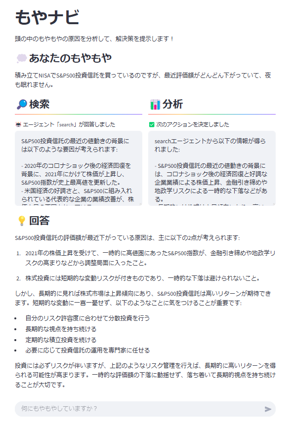

# もやナビ

## 概要

**もやナビ** は、頭の中のもやもやの原因を分析し、解決策を提示するアプリケーションです。

※みのるんさんの[「わが家の AI 技術顧問」](https://aws.amazon.com/jp/builders-flash/202503/create-ai-advisor-with-bedrock/)を参考とさせていただきました。

## 画面



## アーキテクチャ図


- **フロントエンド**: Streamlit
- **バックエンド**: AWS Lambda
- **AI モデル**: Amazon Bedrock
- **検索エンジン**: Tavily API

## ファイル構成

```
.
├── frontend.py  # Streamlitによるフロントエンド
├── backend.py   # Lambda関数でTavily APIを利用した検索処理
├── .env         # 環境変数設定ファイル（ローカル環境用）
└── README.md    # 本ドキュメント
```

## 環境構築

1. 必要なライブラリをインストール
   ```sh
   pip install -r requirements.txt
   ```
2. `.env` ファイルを作成し、以下の環境変数を設定
   ```sh
   AGENT_ID=your_bedrock_agent_id
   AGENT_ALIAS_ID=your_bedrock_agent_alias_id
   ```

## 実行方法

### **ローカルでの実行**

1. **Tavily API にサインアップし、API キーを取得**

   - [Tavily API](https://www.tavily.com/) にサインアップし、API キーを取得してください。

2. `.env` を設定後、以下のコマンドでフロントエンドを起動

   ```sh
   streamlit run frontend.py
   ```

3. バックエンドの Lambda 関数は AWS 環境で実行されるため、デプロイが必要。

### **AWS Lambda へのデプロイ**

1. **API キーの環境変数を AWS に設定**

   - 取得した `TAVILY_API_KEY` を AWS Lambda の実行環境の環境変数に設定してください。

2. Lambda 環境で `backend.py` をデプロイし、適切な環境変数を AWS 側で設定。

## 注意点

- **制限**: Bedrock のクエリ制限に注意（負荷が高い場合はサービスクォータの引き上げ申請推奨）

## ライセンス

このプロジェクトは MIT ライセンスのもと提供されます。
